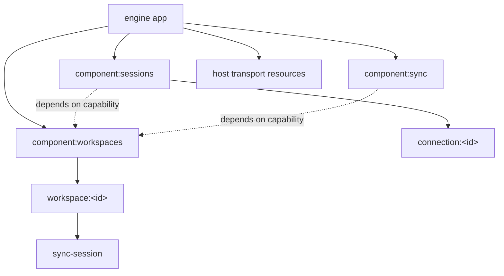

# App Runtime, Ownership, and Shutdown

## Status

Accepted. This replaces the former `ModuleRegistry` / `RuntimeScope` split. Those APIs and their
compatibility paths do not exist.

## Model

Every live runtime unit is a `RuntimeInstance`. The app root, singleton components, keyed
workspaces, workspace sync sessions, connections, and host services all use the same mechanism.

A runtime instance has:

- one stable identity;
- exactly one owner, except for the app root;
- explicitly acquired resources;
- admitted operations and background tasks;
- zero or more child instances;
- one lifecycle state.

`ComponentDefinition` describes singleton identity and capability dependencies. `mount` creates
dynamic keyed instances. Both paths produce the same `RuntimeInstance`; there is no separate dynamic
component framework.

## Two independent topologies

The dependency graph answers “whose capability may I call?” It is a directed acyclic graph resolved
from component definitions. A dependency does not grant ownership.

The ownership tree answers “who keeps me alive and who stops me?” It is established only by mounting
a child or acquiring a resource. Shutdown follows this tree and never follows dependency edges.

Registries and maps are non-owning indexes. They remove entries from `onStopped` notifications but
never perform child teardown loops. A workspace instance owns its sync session even though the sync
coordinator indexes and communicates with it.

## Atomic construction

`RuntimeInstance.mount(identity, create)` is the only child construction path:

1. Create a provisional child.
2. Run its constructor and acquire resources.
3. If the owner is active, start all acquired members in declaration order.
4. Publish the returned component only after construction and startup succeed.
5. On any failure, release every acquired resource and detach the provisional child.

Acquisition establishes ownership immediately. A resource is therefore released during rollback
even when its `start` hook was never reached. Singleton installation additionally rolls back all
already-created components if a later definition fails.

## Execution ownership

Every async activity enters through an instance:

- `run` admits a bounded operation;
- `spawn` owns a background task;
- resource `start` may register tasks on its instance;
- new work is rejected once quiescing begins.

Workspace state is available only inside `WorkspaceRuntime.run` or `runExclusive`. Exclusive
mutations serialize inside the workspace instance, and forced cancellation is observed before a
queued mutation enters user code.

## Shutdown protocol

Stopping an instance stops its complete ownership subtree:

1. **Quiesce** — reject new work, abort producer signals, and close external admission in reverse
   ownership order.
2. **Drain** — wait for admitted operations and background tasks while dependencies and resources
   remain live.
3. **Force** — after the drain deadline, abort forced-operation signals and wait a bounded grace
   period.
4. **Checkpoint** — only after a complete, error-free drain, flush durable state and write clean
   markers.
5. **Release** — release children and resources in reverse ownership order.

`StopReport` preserves teardown errors and abandoned operation names. A clean marker cannot overlap
an accepted mutation. Stop requests are idempotent; concurrent parent/child stop requests cannot
release a resource twice.

## Communication

Communication semantics remain explicit instead of being hidden behind a universal message API:

- injected capabilities provide request/response calls;
- `Bus` carries synchronous typed domain facts such as `Committed`;
- `BoundedAsyncChannel` carries client streams with bounded memory;
- sync transports carry cross-process protocol messages.

Lifecycle is not a domain fact. Index cleanup and subscription detachment use the instance's
`onStopped` signal, so the domain bus contains no `Disposed` bookkeeping message.

## Boundaries

- `domain/membership` is pure policy and replay.
- `runtime/workspace` cannot import sync, session, broker, command, or client layers.
- sync core depends on `SyncTransportFactory`; only sync adapters import broker code.
- broker code is content-blind and cannot import workspace, sync policy, session, or commands.
- session code consumes workspace capabilities and facts but cannot coordinate sync or broker
  lifetimes.
- hosts add resources to `app.root` before starting the complete app.

ESLint enforces the directional code dependencies. Runtime ownership is enforced by construction:
resources enter through `own`, children through `mount`, and neither has another teardown path.

## Invariants

- A runtime instance has exactly one lifecycle owner.
- Mutable workspace state has exactly one state owner.
- A resource, task, operation, subscription, or child has exactly one instance owner.
- Dependency edges never imply ownership.
- Registries index instances but never own their shutdown.
- New work cannot enter a quiescing instance.
- Dependencies remain live until admitted dependents drain.
- Construction is atomic and failure releases all acquired state.
- Clean checkpointing never overlaps active mutation.
- Workspace removal stops its sync session and fact subscriptions in the same ownership subtree.
- Domain communication contains no lifecycle bookkeeping.
- Stop is repeatable and never releases an owned member twice.
